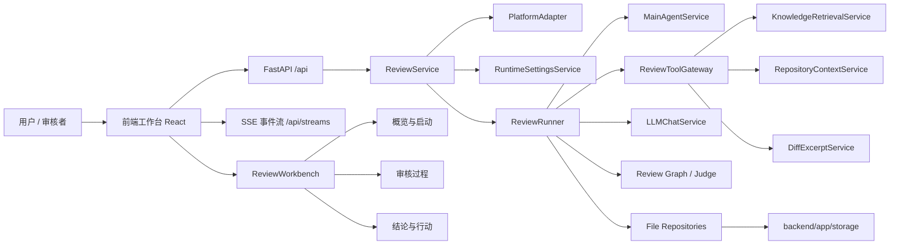
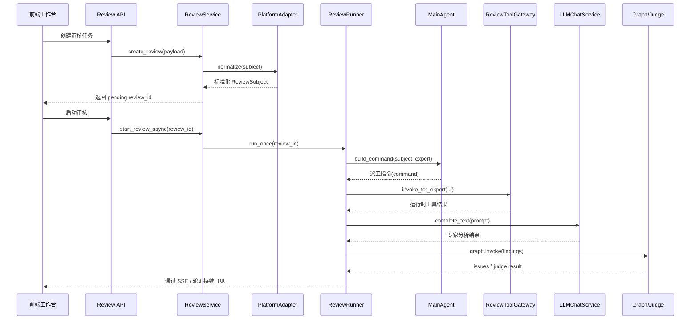
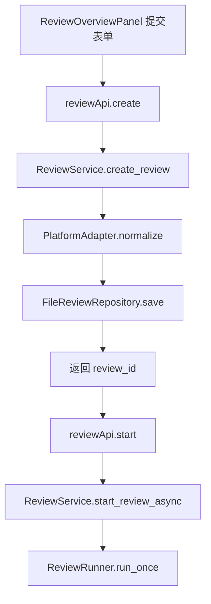
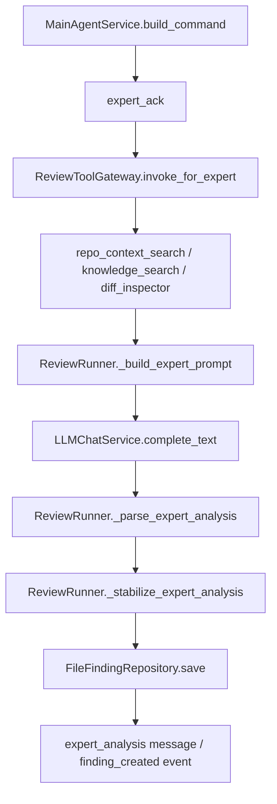
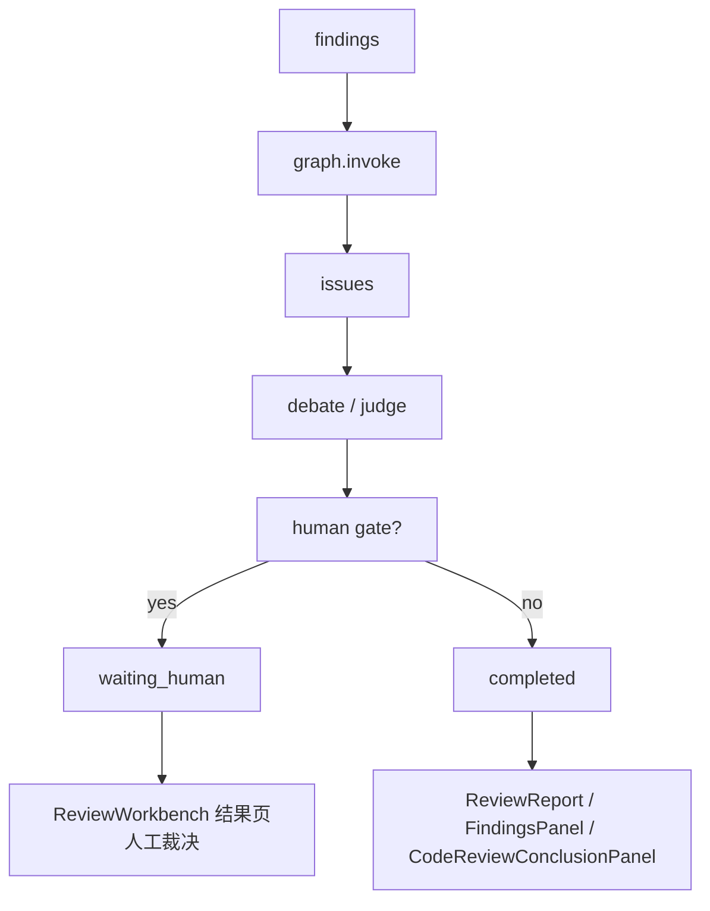

# 多专家代码审核系统 Code Wiki

## 1. 文档定位

这份文档面向后续接手项目的开发者，目标不是罗列所有文件，而是回答下面几个问题：

- 这个系统的前后端总体架构是什么
- 一次代码审核任务是怎么从“用户输入链接”跑到“最终问题清单”的
- 主 Agent、专家 Agent、运行时工具、代码仓检索、Judge、Human Gate 分别扮演什么角色
- 前端工作台为什么是现在这样的三段式结构
- 出现问题时，应该先看哪个类、哪个日志、哪条链路

如果你第一次进入这个仓库，建议先读本文，再按“关键类阅读顺序”去看源码。

---

## 2. 系统总览

这个项目是一个“前后端分离”的多专家代码审核平台。

- 前端是一个 React + Ant Design 工作台
- 后端是一个 FastAPI 应用
- 核心业务不是普通 CRUD，而是“以 review 为中心的多 Agent 审核运行时”

系统的主目标是：

1. 接收一个 GitHub/GitLab/CodeHub 的 PR/MR/commit 输入
2. 拉取真实 diff，并尽量补充目标分支源码上下文
3. 由主 Agent 把改动分派给不同领域专家
4. 专家结合规范文档、知识库、运行时工具和源码仓上下文做审查
5. 汇总成 findings / issues / report
6. 在前端工作台中展示过程、结论和人工裁决

---

## 3. 总体架构图

---

## 4. 后端分层说明

### 4.1 应用层

应用层负责把“用户动作”转成“系统任务”。

关键类：

- [ReviewService](/Users/neochen/multi-codereview-agent/backend/app/services/review_service.py)
- [RuntimeSettingsService](/Users/neochen/multi-codereview-agent/backend/app/services/runtime_settings_service.py)
- [ExpertRegistry](/Users/neochen/multi-codereview-agent/backend/app/services/expert_registry.py)
- [KnowledgeService](/Users/neochen/multi-codereview-agent/backend/app/services/knowledge_service.py)

这一层不直接做大模型分析，它主要负责：

- 创建 review
- 启动 review
- 读写设置
- 读写专家
- 读写知识库

### 4.2 运行时编排层

运行时编排层负责“真正把审核跑起来”。

关键类：

- [ReviewRunner](/Users/neochen/multi-codereview-agent/backend/app/services/review_runner.py)
- [MainAgentService](/Users/neochen/multi-codereview-agent/backend/app/services/main_agent_service.py)
- [build_review_graph](/Users/neochen/multi-codereview-agent/backend/app/services/orchestrator/graph.py)

这一层负责：

- 选专家
- 派工
- 调用运行时工具
- 调用大模型
- 解析 finding
- 通过 graph 收敛 issue
- 触发 judge / human gate

### 4.3 平台适配层

平台适配层负责“把外部 Git 平台输入变成统一审核对象”。

关键类：

- [PlatformAdapter](/Users/neochen/multi-codereview-agent/backend/app/services/platform_adapter.py)
- [GitHubReviewProvider](/Users/neochen/multi-codereview-agent/backend/app/services/platform_adapter.py)
- [GitLabReviewProvider](/Users/neochen/multi-codereview-agent/backend/app/services/platform_adapter.py)

这一层的目标是让 ReviewRunner 不必关心：

- 这是 GitHub 还是 GitLab
- 传进来的是 PR、MR、branch compare 还是 commit
- 远程 diff 应该怎么拉

### 4.4 运行时工具层

运行时工具层负责给专家补证据。

关键类：

- [ReviewToolGateway](/Users/neochen/multi-codereview-agent/backend/app/services/tool_gateway.py)
- [RepositoryContextService](/Users/neochen/multi-codereview-agent/backend/app/services/repository_context_service.py)
- [DiffExcerptService](/Users/neochen/multi-codereview-agent/backend/app/services/diff_excerpt_service.py)
- [KnowledgeRetrievalService](/Users/neochen/multi-codereview-agent/backend/app/services/knowledge_retrieval_service.py)

当前内建运行时工具包括：

- `knowledge_search`
- `diff_inspector`
- `test_surface_locator`
- `dependency_surface_locator`
- `repo_context_search`

### 4.5 模型调用层

关键类：

- [LLMChatService](/Users/neochen/multi-codereview-agent/backend/app/services/llm_chat_service.py)

这一层统一处理：

- 模型配置解析
- 请求/响应日志
- JSON / SSE 两种响应格式兼容
- 超时、重试、fallback 策略

### 4.6 持久化层

关键 repository：

- [FileReviewRepository](/Users/neochen/multi-codereview-agent/backend/app/repositories/file_review_repository.py)
- [FileMessageRepository](/Users/neochen/multi-codereview-agent/backend/app/repositories/file_message_repository.py)
- [FileFindingRepository](/Users/neochen/multi-codereview-agent/backend/app/repositories/file_finding_repository.py)
- [FileIssueRepository](/Users/neochen/multi-codereview-agent/backend/app/repositories/file_issue_repository.py)
- [FileEventRepository](/Users/neochen/multi-codereview-agent/backend/app/repositories/file_event_repository.py)

当前主存储是文件型存储，路径集中在：

- [backend/app/storage](/Users/neochen/multi-codereview-agent/backend/app/storage)

---

## 5. 一次审核任务的后端流程

---

## 6. 审核流程的关键调用图

### 6.1 创建与启动

### 6.2 单个专家任务链

### 6.3 收敛与结果

---

## 7. 主 Agent、专家、Judge 的职责边界

### 主 Agent

关键类：

- [MainAgentService](/Users/neochen/multi-codereview-agent/backend/app/services/main_agent_service.py)

职责：

- 识别关联变更链
- 决定哪些专家应该参与
- 为每个专家指定目标文件、目标 hunk、必查项、禁止推断项
- 审核结束后输出主总结

不负责：

- 直接给出最终 finding
- 越俎代庖替代专家做领域分析

### 专家 Agent

实际执行入口在：

- [ReviewRunner._run_expert_from_command](/Users/neochen/multi-codereview-agent/backend/app/services/review_runner.py)

职责：

- 严格按自己的职责边界分析代码
- 读取：
  - MR/PR diff 片段
  - target hunk
  - 代码仓上下文
  - 绑定规范文档
  - 绑定参考文档
  - 运行时工具结果
- 输出结构化 finding

### Judge / Graph

关键入口：

- [build_review_graph](/Users/neochen/multi-codereview-agent/backend/app/services/orchestrator/graph.py)

职责：

- 把多条 findings 合并成 issue
- 决定某条 issue 是直接收敛、待验证还是进入人工 gate

---

## 8. 前端工作台架构

前端真正的核心不是路由，而是：

- [ReviewWorkbenchPage](/Users/neochen/multi-codereview-agent/frontend/src/pages/ReviewWorkbench/index.tsx)

它是整个审核工作台的状态编排器，统一持有：

- 当前 review
- replay bundle
- artifacts
- experts
- runtime settings
- 当前选中的 issue / finding

### 前端三页签结构

#### 8.1 概览与启动

关键组件：

- [ReviewOverviewPanel](/Users/neochen/multi-codereview-agent/frontend/src/components/review/ReviewOverviewPanel.tsx)

职责：

- 输入 PR/MR/commit 链接
- 选择分析模式
- 选择专家
- 创建并启动审核

#### 8.2 审核过程

关键组件：

- [ReviewDialogueStream](/Users/neochen/multi-codereview-agent/frontend/src/components/review/ReviewDialogueStream.tsx)
- [DiffPreviewPanel](/Users/neochen/multi-codereview-agent/frontend/src/components/review/DiffPreviewPanel.tsx)
- [IssueThreadList](/Users/neochen/multi-codereview-agent/frontend/src/components/review/IssueThreadList.tsx)
- [EventTimeline](/Users/neochen/multi-codereview-agent/frontend/src/components/review/EventTimeline.tsx)

职责：

- 展示主 Agent 派工
- 展示专家聊天式过程
- 展示工具调用
- 展示当前 diff 和 issue thread

#### 8.3 结论与行动

关键组件：

- [ReportSummaryPanel](/Users/neochen/multi-codereview-agent/frontend/src/components/review/ReportSummaryPanel.tsx)
- [FindingsPanel](/Users/neochen/multi-codereview-agent/frontend/src/components/review/FindingsPanel.tsx)
- [CodeReviewConclusionPanel](/Users/neochen/multi-codereview-agent/frontend/src/components/review/CodeReviewConclusionPanel.tsx)
- [HumanGatePanel](/Users/neochen/multi-codereview-agent/frontend/src/components/review/HumanGatePanel.tsx)

职责：

- 汇总最终 code review 报告
- 展示问题清单
- 展示修复建议与建议代码
- 处理人工裁决

---

## 9. 关键类阅读顺序

如果你准备开始修改这个项目，推荐按下面顺序读：

### 后端阅读顺序

1. [ReviewService](/Users/neochen/multi-codereview-agent/backend/app/services/review_service.py)
2. [PlatformAdapter](/Users/neochen/multi-codereview-agent/backend/app/services/platform_adapter.py)
3. [ReviewRunner](/Users/neochen/multi-codereview-agent/backend/app/services/review_runner.py)
4. [MainAgentService](/Users/neochen/multi-codereview-agent/backend/app/services/main_agent_service.py)
5. [ReviewToolGateway](/Users/neochen/multi-codereview-agent/backend/app/services/tool_gateway.py)
6. [RepositoryContextService](/Users/neochen/multi-codereview-agent/backend/app/services/repository_context_service.py)
7. [LLMChatService](/Users/neochen/multi-codereview-agent/backend/app/services/llm_chat_service.py)
8. [graph.py](/Users/neochen/multi-codereview-agent/backend/app/services/orchestrator/graph.py)

### 前端阅读顺序

1. [ReviewWorkbenchPage](/Users/neochen/multi-codereview-agent/frontend/src/pages/ReviewWorkbench/index.tsx)
2. [ReviewOverviewPanel](/Users/neochen/multi-codereview-agent/frontend/src/components/review/ReviewOverviewPanel.tsx)
3. [ReviewDialogueStream](/Users/neochen/multi-codereview-agent/frontend/src/components/review/ReviewDialogueStream.tsx)
4. [DiffPreviewPanel](/Users/neochen/multi-codereview-agent/frontend/src/components/review/DiffPreviewPanel.tsx)
5. [FindingsPanel](/Users/neochen/multi-codereview-agent/frontend/src/components/review/FindingsPanel.tsx)
6. [api.ts](/Users/neochen/multi-codereview-agent/frontend/src/services/api.ts)

---

## 10. 专家审查真正依赖哪些输入

一个专家在实际执行时，不是只拿到一段 prompt。

它的真实输入包括：

1. 当前 PR/MR/commit 的 diff 片段
2. 主 Agent 选出来的 target hunk
3. 主 Agent 推导出的 related files
4. `repo_context_search` 提供的目标分支源码上下文
5. `knowledge_search` 命中的专家绑定文档
6. 专家的核心规范文档
7. 其他运行时工具结果

对应关键代码：

- [ReviewRunner._build_expert_prompt](/Users/neochen/multi-codereview-agent/backend/app/services/review_runner.py)
- [ReviewRunner._build_expert_system_prompt](/Users/neochen/multi-codereview-agent/backend/app/services/review_runner.py)

---

## 11. 日志与排障入口

### 11.1 后端日志

路径：

- [logs/backend.log](/Users/neochen/multi-codereview-agent/logs/backend.log)

重点看这些关键词：

- `review created`
- `review queued`
- `review execution`
- `main_agent_command`
- `expert_tool_invoked`
- `llm request send`
- `llm response received`
- `llm response parsed`
- `review finished`

### 11.2 常见问题定位

#### 页面显示 completed 过快

优先检查：

- 是否没有匹配到任何 enabled expert
- 是否远程 diff 没拿到

关键代码：

- [ReviewService.start_review_async](/Users/neochen/multi-codereview-agent/backend/app/services/review_service.py)
- [ReviewRunner.run_once](/Users/neochen/multi-codereview-agent/backend/app/services/review_runner.py)

#### 专家一直看错文件

优先检查：

- 主 Agent 是否拿到了真实 changed_files
- target_hunk 是否定位错误
- repo context 是否混入噪声文件

关键代码：

- [MainAgentService.build_command](/Users/neochen/multi-codereview-agent/backend/app/services/main_agent_service.py)
- [RepositoryContextService](/Users/neochen/multi-codereview-agent/backend/app/services/repository_context_service.py)

#### Windows 下 LLM decode failed

优先检查：

- 返回 `content-type` 是否为 `text/event-stream`
- 是否走了 SSE 解析
- body preview 是否为空或被代理改写

关键代码：

- [LLMChatService.complete_text](/Users/neochen/multi-codereview-agent/backend/app/services/llm_chat_service.py)

---

## 12. 后续扩展建议

如果要继续增强当前系统，优先级建议如下：

1. 更严格的 Judge 证据分级
2. 更强的 repo context 过滤和调用链检索
3. 更多 Git 平台 provider 落地
4. 运行时工具与专家绑定的治理界面继续完善
5. 更细的报告导出和历史回放能力

---

## 13. 快速结论

如果只用一句话概括当前系统：

> 这是一个以 `ReviewRunner + MainAgentService + ReviewToolGateway + ReviewWorkbench` 为核心的多专家代码审核平台；前端是它的控制台，后端是它的运行时。

