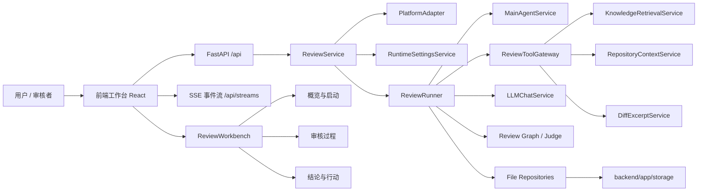
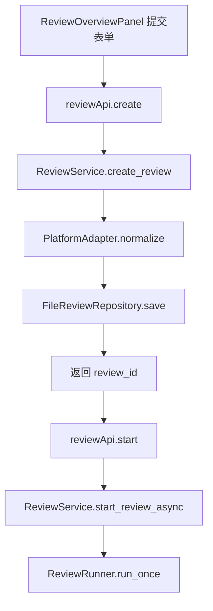
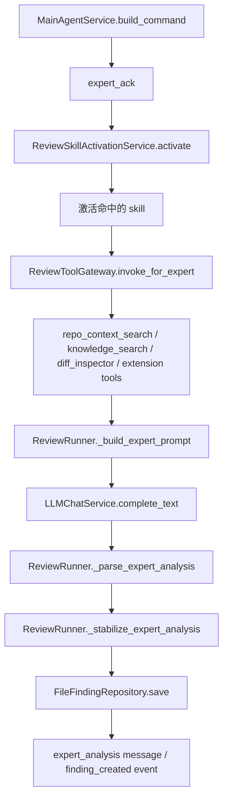
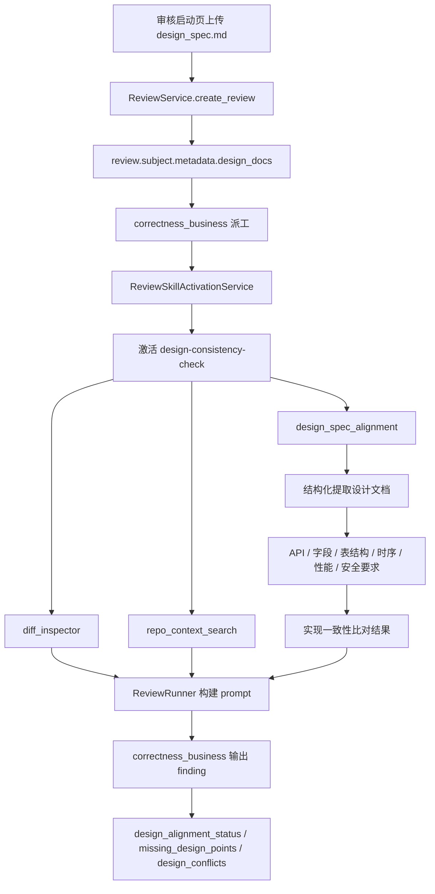
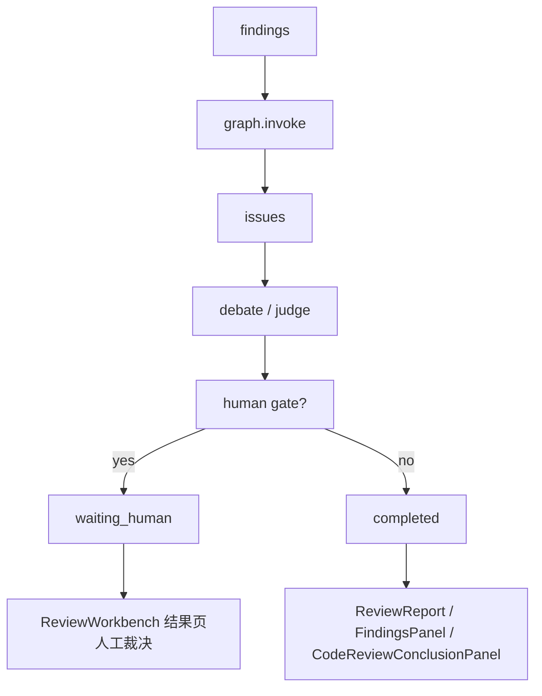

# 多专家代码审核系统 Code Wiki

## 1. 文档定位

这份文档面向后续接手项目的开发者，目标不是罗列所有文件，而是回答下面几个问题：

- 这个系统的前后端总体架构是什么
- 一次代码审核任务是怎么从“用户输入链接”跑到“最终问题清单”的
- 主 Agent、专家 Agent、运行时工具、代码仓检索、Judge、Human Gate 分别扮演什么角色
- 前端工作台为什么是现在这样的三段式结构
- 出现问题时，应该先看哪个类、哪个日志、哪条链路

如果你第一次进入这个仓库，建议先读本文，再按“关键类阅读顺序”去看源码。

---

## 2. 系统总览

这个项目是一个“前后端分离”的多专家代码审核平台。

- 前端是一个 React + Ant Design 工作台
- 后端是一个 FastAPI 应用
- 核心业务不是普通 CRUD，而是“以 review 为中心的多 Agent 审核运行时”

系统的主目标是：

1. 接收一个 GitHub/GitLab/CodeHub 的 PR/MR/commit 输入
2. 拉取真实 diff，并尽量补充目标分支源码上下文
3. 由主 Agent 把改动分派给不同领域专家
4. 专家结合规范文档、知识库、运行时工具和源码仓上下文做审查
5. 汇总成 findings / issues / report
6. 在前端工作台中展示过程、结论和人工裁决

---

## 3. 总体架构图



---

## 4. 后端分层说明

### 4.1 应用层

应用层负责把“用户动作”转成“系统任务”。

关键类：

- [ReviewService](/Users/neochen/multi-codereview-agent/backend/app/services/review_service.py)
- [RuntimeSettingsService](/Users/neochen/multi-codereview-agent/backend/app/services/runtime_settings_service.py)
- [ExpertRegistry](/Users/neochen/multi-codereview-agent/backend/app/services/expert_registry.py)
- [KnowledgeService](/Users/neochen/multi-codereview-agent/backend/app/services/knowledge_service.py)

这一层不直接做大模型分析，它主要负责：

- 创建 review
- 启动 review
- 读写设置
- 读写专家
- 读写知识库

### 4.2 运行时编排层

运行时编排层负责“真正把审核跑起来”。

关键类：

- [ReviewRunner](/Users/neochen/multi-codereview-agent/backend/app/services/review_runner.py)
- [MainAgentService](/Users/neochen/multi-codereview-agent/backend/app/services/main_agent_service.py)
- [build_review_graph](/Users/neochen/multi-codereview-agent/backend/app/services/orchestrator/graph.py)

这一层负责：

- 选专家
- 派工
- 调用运行时工具
- 调用大模型
- 解析 finding
- 通过 graph 收敛 issue
- 触发 judge / human gate

### 4.3 平台适配层

平台适配层负责“把外部 Git 平台输入变成统一审核对象”。

关键类：

- [PlatformAdapter](/Users/neochen/multi-codereview-agent/backend/app/services/platform_adapter.py)
- [GitHubReviewProvider](/Users/neochen/multi-codereview-agent/backend/app/services/platform_adapter.py)
- [GitLabReviewProvider](/Users/neochen/multi-codereview-agent/backend/app/services/platform_adapter.py)

这一层的目标是让 ReviewRunner 不必关心：

- 这是 GitHub 还是 GitLab
- 传进来的是 PR、MR、branch compare 还是 commit
- 远程 diff 应该怎么拉

### 4.4 运行时工具层

运行时工具层负责给专家补证据。

关键类：

- [ReviewToolGateway](/Users/neochen/multi-codereview-agent/backend/app/services/tool_gateway.py)
- [RepositoryContextService](/Users/neochen/multi-codereview-agent/backend/app/services/repository_context_service.py)
- [DiffExcerptService](/Users/neochen/multi-codereview-agent/backend/app/services/diff_excerpt_service.py)
- [KnowledgeRetrievalService](/Users/neochen/multi-codereview-agent/backend/app/services/knowledge_retrieval_service.py)

当前内建运行时工具包括：

- `knowledge_search`
- `diff_inspector`
- `test_surface_locator`
- `dependency_surface_locator`
- `repo_context_search`

除了这些内建运行时工具，系统还支持通过 `extensions/tools` 加载可插拔工具，例如：

- `design_spec_alignment`

### 4.5 Skill + Tool 插件扩展层

这是当前代码审核系统新增的一层能力扩展机制，目标是：

- 让专家能力通过插件扩展，而不是持续修改主审核流程
- 新增能力时优先只改 `extensions/`
- 让专家根据 review 上下文按需加载 skill，再展开对应 tools

核心设计是双层结构：

- `skill`
  - 上层能力包
  - 使用目录式 `SKILL.md`
  - 负责定义：
    - 适用专家
    - 激活条件
    - 依赖的 tools
    - 输出契约
- `tool`
  - 下层执行插件
  - 默认使用 Python 子进程实现
  - 负责真正执行检索、提取、比对和结构化分析

目录约定：

```text
extensions/
  skills/
    design-consistency-check/
      SKILL.md
      metadata.json
  tools/
    design_spec_alignment/
      tool.json
      run.py
```

关键实现：

- [ReviewSkillProfile](/Users/neochen/multi-codereview-agent/backend/app/domain/models/review_skill.py)
- [ReviewSkillRegistry](/Users/neochen/multi-codereview-agent/backend/app/services/review_skill_registry.py)
- [ReviewSkillActivationService](/Users/neochen/multi-codereview-agent/backend/app/services/review_skill_activation_service.py)
- [ReviewToolPlugin](/Users/neochen/multi-codereview-agent/backend/app/domain/models/review_tool_plugin.py)
- [ToolPluginLoader](/Users/neochen/multi-codereview-agent/backend/app/services/tool_plugin_loader.py)

#### skill 是如何绑定到专家的

当前机制优先从 extension 目录的 `metadata.json` 读取 skill 绑定，而不是要求修改内置专家 yaml。

关键字段：

- `bound_experts`

例如：

- [extensions/skills/design-consistency-check/metadata.json](/Users/neochen/multi-codereview-agent/extensions/skills/design-consistency-check/metadata.json)

会把 `design-consistency-check` 绑定到：

- `correctness_business`

运行时会把这些 extension 绑定合并进专家有效配置，因此专家中心可以同时展示：

- `源码绑定`
- `Extension 绑定`

#### skill 什么时候被激活

skill 不是在专家启动时全量加载，而是在专家开始执行前由 runtime 规则化判断。

判定逻辑集中在：

- [ReviewSkillActivationService](/Users/neochen/multi-codereview-agent/backend/app/services/review_skill_activation_service.py)

当前采用的规则大致是：

```text
expert 已绑定该 skill
AND 当前 expert 在 applicable_experts 内
AND 当前模式在 allowed_modes 内
AND required_doc_types 满足
AND changed_files 命中 activation_hints
AND required_context 满足
=> 激活 skill
```

这意味着：

- 是否加载 skill，不由 LLM 自己决定
- 由 runtime 结合 review 上下文稳定判断

#### skill 激活后如何工作

skill 被激活后，运行时会：

1. 读取 `SKILL.md` 正文
2. 根据 `required_tools` 展开对应 tools
3. 执行这些 tools
4. 把以下内容一起注入专家 prompt：
   - 当前 diff / hunk
   - repo context
   - review 绑定文档
   - skill 规则
   - tool 结果

最终这条链主要落在：

- [ReviewRunner](/Users/neochen/multi-codereview-agent/backend/app/services/review_runner.py)
- [ReviewToolGateway](/Users/neochen/multi-codereview-agent/backend/app/services/tool_gateway.py)

### 4.6 模型调用层

关键类：

- [LLMChatService](/Users/neochen/multi-codereview-agent/backend/app/services/llm_chat_service.py)

这一层统一处理：

- 模型配置解析
- 请求/响应日志
- JSON / SSE 两种响应格式兼容
- 超时、重试、fallback 策略

### 4.7 持久化层

关键 repository：

- [FileReviewRepository](/Users/neochen/multi-codereview-agent/backend/app/repositories/file_review_repository.py)
- [FileMessageRepository](/Users/neochen/multi-codereview-agent/backend/app/repositories/file_message_repository.py)
- [FileFindingRepository](/Users/neochen/multi-codereview-agent/backend/app/repositories/file_finding_repository.py)
- [FileIssueRepository](/Users/neochen/multi-codereview-agent/backend/app/repositories/file_issue_repository.py)
- [FileEventRepository](/Users/neochen/multi-codereview-agent/backend/app/repositories/file_event_repository.py)

当前主存储是文件型存储，路径集中在：

- [backend/app/storage](/Users/neochen/multi-codereview-agent/backend/app/storage)

---

## 5. 一次审核任务的后端流程

```mermaid
sequenceDiagram
  participant UI as 前端工作台
  participant API as Review API
  participant RS as ReviewService
  participant PA as PlatformAdapter
  participant RR as ReviewRunner
  participant MA as MainAgent
  participant TG as ReviewToolGateway
  participant LLM as LLMChatService
  participant JG as Graph/Judge

  UI->>API: 创建审核任务
  API->>RS: create_review(payload)
  RS->>PA: normalize(subject)
  PA-->>RS: 标准化 ReviewSubject
  RS-->>UI: 返回 pending review_id

  UI->>API: 启动审核
  API->>RS: start_review_async(review_id)
  RS->>RR: run_once(review_id)

  RR->>MA: build_command(subject, expert)
  MA-->>RR: 派工指令(command)
  RR->>TG: invoke_for_expert(...)
  TG-->>RR: 运行时工具结果
  RR->>LLM: complete_text(prompt)
  LLM-->>RR: 专家分析结果
  RR->>JG: graph.invoke(findings)
  JG-->>RR: issues / judge result
  RR-->>UI: 通过 SSE / 轮询持续可见

---

## 6. Issue 置信度模型

`issue.confidence` 的计算不在前端，也不是简单复用某一条 finding 的分数。

当前实现里，这个值是在 orchestrator 的 issue 聚合阶段统一生成的，核心节点是：

- [detect_conflicts.py](/Users/neochen/multi-codereview-agent/backend/app/services/orchestrator/nodes/detect_conflicts.py)

### 6.1 数据从哪里来

一次 expert 审查结束后，`ReviewRunner` 会产出 `ReviewFinding`。

其中：

- `finding.confidence`
  - 来自专家基线分 + LLM 输出后的归一化结果
- `finding.finding_type`
  - 例如 `direct_defect`、`risk_hypothesis`、`test_gap`、`design_concern`
- `evidence / cross_file_evidence / context_files / matched_rules / violated_guidelines`
  - 这些字段会一起进入后续 issue 聚合

相关代码：

- [review_runner.py](/Users/neochen/multi-codereview-agent/backend/app/services/review_runner.py)

### 6.2 issue 是如何聚合出来的

`detect_conflicts` 会先按下面的方式分组：

```text
key = file_path + line_bucket
line_bucket = ((line_start - 1) // 25) + 1
```

也就是说，同一文件、相近行号窗口内的 findings 会先尝试被聚成一个 issue 候选。

在每个候选分组里，系统会先执行 issue 升级治理规则：

- 是否低于最低 P 级阈值
- 是否属于纯提示性问题
- 是否属于非代码检视范围
- 是否低于对应 P 级的 issue 置信度阈值

只有通过这些规则的 findings，才会进入最终 issue 聚合。

### 6.3 当前 issue 置信度公式

现在采用的是“加权基础分 + 修正项”的模型：

```text
issue_confidence
= base_weighted_confidence
+ consensus_bonus
+ evidence_bonus
+ verification_bonus
- hypothesis_penalty
```

最后结果会被裁剪到 `0.01 ~ 0.99`，并保留两位小数。

### 6.4 base_weighted_confidence

基础分不是简单平均，而是先按 finding 类型加权：

```text
direct_defect    -> 1.00
test_gap         -> 0.80
risk_hypothesis  -> 0.65
design_concern   -> 0.55
```

对应实现里，单个 issue 的基础分计算方式等价于：

```text
sum(finding.confidence * finding_type_weight) / sum(finding_type_weight)
```

这一步解决的是：

- `direct_defect` 不该和纯 hypothesis 完全同权
- `test_gap` 要比 design concern 更靠近“可执行问题”

### 6.5 consensus_bonus

如果一个 issue 由多个不同专家共同命中，会增加一致性加分。

当前策略：

- 2 个专家开始给加分
- 每增加一个专家继续小幅加分
- 上限 `0.08`

这一步的目标是表达：

- “多专家独立指向同一个问题”比“单专家孤立结论”更稳定

### 6.6 evidence_bonus

系统会收集 issue 内所有 findings 的证据信号，包括：

- `evidence`
- `cross_file_evidence`
- `context_files`
- `matched_rules`
- `violated_guidelines`

这些信号去重后形成 `evidence_signal_count`，再转成证据加分。

另外，只要 issue 内存在 `direct_defect`，还会额外得到一档直接证据加分。

当前上限是：

- `0.06`

### 6.7 hypothesis_penalty

如果一个 issue 满足以下条件：

- 全部 findings 都是 `risk_hypothesis`
- 全部都还需要验证
- 没有 `direct_defect`

系统会给它一个负向修正，避免纯推测类 issue 被抬得过高。

如果同时还是：

- 单专家结论
- 证据信号很少

扣分会继续增加。

当前上限是：

- `0.12`

### 6.8 verification_bonus

在当前聚合节点中，`verification_bonus` 先固定为 `0.0`，但字段已经保留。

后续 evidence verification 节点会继续处理 issue：

- [evidence_verification.py](/Users/neochen/multi-codereview-agent/backend/app/services/orchestrator/nodes/evidence_verification.py)

如果 verifier 验证通过，系统会把：

- `issue.confidence`
- `verification_result.score`

取较大值，并把最终分数上限封到 `0.98`。

所以实际运行时的 issue 置信度链路是：

```text
finding.confidence
-> detect_conflicts 计算 issue.confidence
-> evidence_verification 按工具核验结果上调
```

### 6.9 为什么 issue 和 finding 的置信度会不同

这是现在前端最容易看到、也最容易误解的一点。

原因是：

- finding 展示的是“单条专家结论”的置信度
- issue 展示的是“多个 findings 聚合后的议题级置信度”

所以即使：

- 正式问题清单和审核发现清单的文本内容很相近

也可能出现：

- finding 是 `0.78`
- issue 是 `0.95`

因为 issue 这里已经吃进去了：

- finding 类型权重
- 多专家一致性
- 证据强度
- 后续 verifier 上调

### 6.10 confidence_breakdown 字段

为了让这套模型可解释，当前 issue 上会附带：

- `confidence_breakdown`

它至少包含：

- `base_weighted_confidence`
- `consensus_bonus`
- `evidence_bonus`
- `verification_bonus`
- `hypothesis_penalty`
- `final_confidence`
- `participant_count`
- `evidence_signal_count`
- `direct_evidence`
- `finding_count`

相关模型与接线位置：

- [issue.py](/Users/neochen/multi-codereview-agent/backend/app/domain/models/issue.py)
- [review_runner.py](/Users/neochen/multi-codereview-agent/backend/app/services/review_runner.py)
- [api.ts](/Users/neochen/multi-codereview-agent/frontend/src/services/api.ts)

这个字段的价值主要有两个：

1. 给前端详情页解释“为什么这个 issue 是这个分数”
2. 给后续调参和排查提供可观测性
```

---

## 6. 审核流程的关键调用图

### 6.1 创建与启动



### 6.2 单个专家任务链



### 6.3 详细设计一致性检查调用链



### 6.4 收敛与结果



---

## 7. 主 Agent、专家、Judge 的职责边界

### 主 Agent

关键类：

- [MainAgentService](/Users/neochen/multi-codereview-agent/backend/app/services/main_agent_service.py)

职责：

- 识别关联变更链
- 决定哪些专家应该参与
- 为每个专家指定目标文件、目标 hunk、必查项、禁止推断项
- 审核结束后输出主总结

主 Agent 当前真正拿到的 diff 上下文不是“整份 MR 原样截断”。

当前实现是：

- 主要业务文件完整 diff
- 其他变更文件摘要
- 候选 hunk 列表

这样做是为了同时满足两个目标：

- 派工时保留足够的全局变更信号
- 避免大 MR 时直接把整份 `unified_diff` 裸塞进 prompt 导致上下文浪费

关键实现：

- [MainAgentService._build_routing_user_prompt](/Users/neochen/multi-codereview-agent/backend/app/services/main_agent_service.py)
- [MainAgentService._build_expert_selection_user_prompt](/Users/neochen/multi-codereview-agent/backend/app/services/main_agent_service.py)
- [DiffExcerptService.extract_file_diff](/Users/neochen/multi-codereview-agent/backend/app/services/diff_excerpt_service.py)

不负责：

- 直接给出最终 finding
- 越俎代庖替代专家做领域分析

### 专家 Agent

实际执行入口在：

- [ReviewRunner._run_expert_from_command](/Users/neochen/multi-codereview-agent/backend/app/services/review_runner.py)

职责：

- 严格按自己的职责边界分析代码
- 读取：
  - 目标文件完整 diff
  - 其他变更文件摘要
  - target hunk
  - 当前代码片段 excerpt
  - 代码仓上下文
  - 绑定规范文档
  - 绑定参考文档
  - 已激活的 skills
  - 运行时工具结果
- 输出结构化 finding

这里有一个关键约束：

- 专家 prompt 不能只给 `target_hunk` 或 `code_excerpt`
- 否则当前 hunk 之外、但仍属于同一目标文件的重要变更会丢失
- 前端 diff 预览看到“完整 diff”并不代表专家真的拿到了完整文件级上下文

当前实现已经修成：

- 目标文件完整 diff
- 其他变更文件摘要
- target hunk
- excerpt
- repo context
- tool results

关键实现：

- [ReviewRunner._build_expert_prompt](/Users/neochen/multi-codereview-agent/backend/app/services/review_runner.py)
- [ReviewRunner._build_target_file_full_diff](/Users/neochen/multi-codereview-agent/backend/app/services/review_runner.py)
- [ReviewRunner._build_related_diff_summary](/Users/neochen/multi-codereview-agent/backend/app/services/review_runner.py)
- [DiffExcerptService.extract_file_diff](/Users/neochen/multi-codereview-agent/backend/app/services/diff_excerpt_service.py)

#### 专家如何消费 skill

专家不会自己“想起”去加载 skill，而是消费 runtime 已经激活好的能力包。

以 `correctness_business` 为例，如果本轮满足：

- review 绑定了 `design_spec` 文档
- changed_files 命中了 service / transformer / output 等激活线索
- 当前分析模式允许

那么 runtime 会自动激活：

- `design-consistency-check`

并为它展开：

- `diff_inspector`
- `repo_context_search`
- `design_spec_alignment`

最终正确性专家生成的 finding 会新增：

- `design_alignment_status`
- `design_doc_titles`
- `matched_design_points`
- `missing_design_points`
- `extra_implementation_points`
- `design_conflicts`

### Judge / Graph

关键入口：

- [build_review_graph](/Users/neochen/multi-codereview-agent/backend/app/services/orchestrator/graph.py)

职责：

- 把多条 findings 合并成 issue
- 决定某条 issue 是直接收敛、待验证还是进入人工 gate

---

## 8. 前端工作台架构

前端真正的核心不是路由，而是：

- [ReviewWorkbenchPage](/Users/neochen/multi-codereview-agent/frontend/src/pages/ReviewWorkbench/index.tsx)

它是整个审核工作台的状态编排器，统一持有：

- 当前 review
- replay bundle
- artifacts
- experts
- runtime settings
- 当前选中的 issue / finding

### 前端三页签结构

#### 8.1 概览与启动

关键组件：

- [ReviewOverviewPanel](/Users/neochen/multi-codereview-agent/frontend/src/components/review/ReviewOverviewPanel.tsx)

职责：

- 输入 PR/MR/commit 链接
- 选择分析模式
- 选择专家
- 上传本次审核专属的详细设计文档
- 创建并启动审核

#### 8.2 审核过程

关键组件：

- [ReviewDialogueStream](/Users/neochen/multi-codereview-agent/frontend/src/components/review/ReviewDialogueStream.tsx)
- [DiffPreviewPanel](/Users/neochen/multi-codereview-agent/frontend/src/components/review/DiffPreviewPanel.tsx)
- [IssueThreadList](/Users/neochen/multi-codereview-agent/frontend/src/components/review/IssueThreadList.tsx)
- [EventTimeline](/Users/neochen/multi-codereview-agent/frontend/src/components/review/EventTimeline.tsx)

职责：

- 展示主 Agent 派工
- 展示专家聊天式过程
- 展示工具调用
- 展示当前 diff 和 issue thread

#### 8.3 结论与行动

关键组件：

- [ReportSummaryPanel](/Users/neochen/multi-codereview-agent/frontend/src/components/review/ReportSummaryPanel.tsx)
- [FindingsPanel](/Users/neochen/multi-codereview-agent/frontend/src/components/review/FindingsPanel.tsx)
- [CodeReviewConclusionPanel](/Users/neochen/multi-codereview-agent/frontend/src/components/review/CodeReviewConclusionPanel.tsx)
- [HumanGatePanel](/Users/neochen/multi-codereview-agent/frontend/src/components/review/HumanGatePanel.tsx)

职责：

- 汇总最终 code review 报告
- 展示问题清单
- 展示修复建议与建议代码
- 处理人工裁决

---

## 9. 关键类阅读顺序

如果你准备开始修改这个项目，推荐按下面顺序读：

### 后端阅读顺序

1. [ReviewService](/Users/neochen/multi-codereview-agent/backend/app/services/review_service.py)
2. [PlatformAdapter](/Users/neochen/multi-codereview-agent/backend/app/services/platform_adapter.py)
3. [ReviewRunner](/Users/neochen/multi-codereview-agent/backend/app/services/review_runner.py)
4. [MainAgentService](/Users/neochen/multi-codereview-agent/backend/app/services/main_agent_service.py)
5. [ReviewToolGateway](/Users/neochen/multi-codereview-agent/backend/app/services/tool_gateway.py)
6. [RepositoryContextService](/Users/neochen/multi-codereview-agent/backend/app/services/repository_context_service.py)
7. [LLMChatService](/Users/neochen/multi-codereview-agent/backend/app/services/llm_chat_service.py)
8. [graph.py](/Users/neochen/multi-codereview-agent/backend/app/services/orchestrator/graph.py)

### 前端阅读顺序

1. [ReviewWorkbenchPage](/Users/neochen/multi-codereview-agent/frontend/src/pages/ReviewWorkbench/index.tsx)
2. [ReviewOverviewPanel](/Users/neochen/multi-codereview-agent/frontend/src/components/review/ReviewOverviewPanel.tsx)
3. [ReviewDialogueStream](/Users/neochen/multi-codereview-agent/frontend/src/components/review/ReviewDialogueStream.tsx)
4. [DiffPreviewPanel](/Users/neochen/multi-codereview-agent/frontend/src/components/review/DiffPreviewPanel.tsx)
5. [FindingsPanel](/Users/neochen/multi-codereview-agent/frontend/src/components/review/FindingsPanel.tsx)
6. [api.ts](/Users/neochen/multi-codereview-agent/frontend/src/services/api.ts)

---

## 10. 专家审查真正依赖哪些输入

一个专家在实际执行时，不是只拿到一段 prompt。

它的真实输入包括：

1. 目标文件完整 diff
2. 其他变更文件摘要
3. 主 Agent 选出来的 target hunk
4. 当前代码片段 excerpt
5. 主 Agent 推导出的 related files
6. `repo_context_search` 提供的目标分支源码上下文
7. `knowledge_search` 命中的专家绑定文档
8. 专家的核心规范文档
9. 其他运行时工具结果

对应关键代码：

- [ReviewRunner._build_expert_prompt](/Users/neochen/multi-codereview-agent/backend/app/services/review_runner.py)
- [ReviewRunner._build_expert_system_prompt](/Users/neochen/multi-codereview-agent/backend/app/services/review_runner.py)

---

## 11. 日志与排障入口

### 11.1 后端日志

路径：

- [logs/backend.log](/Users/neochen/multi-codereview-agent/logs/backend.log)

重点看这些关键词：

- `review created`
- `review queued`
- `review execution`
- `main_agent_command`
- `expert_tool_invoked`
- `llm request send`
- `llm response received`
- `llm response parsed`
- `review finished`

### 11.2 常见问题定位

#### 页面显示 completed 过快

优先检查：

- 是否没有匹配到任何 enabled expert
- 是否远程 diff 没拿到

关键代码：

- [ReviewService.start_review_async](/Users/neochen/multi-codereview-agent/backend/app/services/review_service.py)
- [ReviewRunner.run_once](/Users/neochen/multi-codereview-agent/backend/app/services/review_runner.py)

#### 专家一直看错文件

优先检查：

- 主 Agent 是否拿到了真实 changed_files
- target_hunk 是否定位错误
- repo context 是否混入噪声文件

关键代码：

- [MainAgentService.build_command](/Users/neochen/multi-codereview-agent/backend/app/services/main_agent_service.py)
- [RepositoryContextService](/Users/neochen/multi-codereview-agent/backend/app/services/repository_context_service.py)

#### Windows 下 LLM decode failed

优先检查：

- 返回 `content-type` 是否为 `text/event-stream`
- 是否走了 SSE 解析
- body preview 是否为空或被代理改写

关键代码：

- [LLMChatService.complete_text](/Users/neochen/multi-codereview-agent/backend/app/services/llm_chat_service.py)

---

## 12. 后续扩展建议

如果要继续增强当前系统，优先级建议如下：

1. 更严格的 Judge 证据分级
2. 更强的 repo context 过滤和调用链检索
3. 更多 Git 平台 provider 落地
4. 运行时工具与专家绑定的治理界面继续完善
5. 更细的报告导出和历史回放能力

---

## 13. 快速结论

如果只用一句话概括当前系统：

> 这是一个以 `ReviewRunner + MainAgentService + ReviewToolGateway + ReviewWorkbench` 为核心的多专家代码审核平台；前端是它的控制台，后端是它的运行时。
