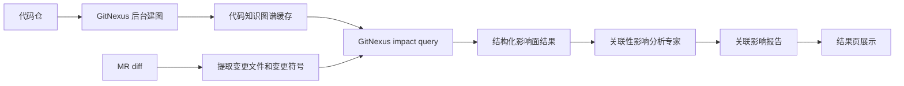

# GitNexus 关联性影响分析专家设计

## 背景

当前系统已经有轻量的跨文件影响提示，例如根据关联文件、调用方、被调方和 diff hunk 给专家补充上下文。但这些提示主要来自启发式规则和代码仓检索，缺少稳定的代码图谱能力。对于每次 MR，研发更需要一份独立的影响面报告，回答两个问题：

- 本次改动可能影响哪些文件、模块、接口、调用链？
- 对应应该测试哪些范围，哪些测试最优先？

本设计新增一个 `关联性影响分析专家 agent`，并使用 GitNexus 作为代码知识图谱与影响分析的底层能力。

## 目标

1. 每个 MR 都输出一份关联影响报告。
2. GitNexus 建图由后台定时任务完成，MR 审核时只查询已有图谱。
3. 影响报告必须包含代码影响范围和建议测试范围。
4. 图谱不可用或过期时，系统仍输出降级版报告，并明确可信度限制。
5. 新专家只负责影响面和测试面，不和业务正确性、数据库、性能、安全等专家重复报问题。

## 非目标

1. 第一版不要求 GitNexus 实时增量建图。
2. 第一版不把影响分析结果强行转成普通 issue。
3. 第一版不依赖 GitNexus 做业务正确性判断。
4. 第一版不要求覆盖所有语言的精确符号分析；不支持的语言可以降级为文件级影响分析。

## 总体架构



## 关键设计

### 1. 后台定时建图

新增 `GitNexusIndexService`，按代码仓维度维护 GitNexus 图谱。

职责：

- 根据系统设置中的代码仓配置定位仓库。
- 定时调用 GitNexus 建图或更新图谱。
- 记录图谱状态。
- 支持手动触发重建。

建议状态字段：

```json
{
  "repo_id": "project-a",
  "repo_path": "/path/to/repo",
  "target_ref": "main",
  "last_indexed_commit": "abc123",
  "last_indexed_at": "2026-04-27T10:00:00Z",
  "graph_status": "ready",
  "error_message": ""
}
```

`graph_status` 取值：

- `ready`：图谱可用，且覆盖目标分支。
- `stale`：图谱可用但落后于目标分支。
- `missing`：没有图谱。
- `failed`：最近一次建图失败。

### 2. MR 审核时查询图谱

新增 `GitNexusImpactService`，负责把 MR diff 转成 GitNexus 查询。

输入：

- `ReviewSubject.changed_files`
- `ReviewSubject.unified_diff`
- `source_ref`
- `target_ref`
- 本地仓库路径
- GitNexus 图谱状态

输出：

```json
{
  "graph_status": "ready",
  "changed_files": [],
  "changed_symbols": [],
  "impacted_files": [],
  "impacted_modules": [],
  "impact_paths": [],
  "external_entrypoints": [],
  "risk_level": "medium",
  "recommended_test_scope": [],
  "must_run_tests": [],
  "manual_verification": [],
  "limitations": []
}
```

### 3. 新增运行时工具

在 `ReviewToolGateway` 中注册 `gitnexus_impact_analysis`。

该工具只做结构化分析，不直接生成自然语言报告。

工具输出示例：

```json
{
  "tool_name": "gitnexus_impact_analysis",
  "success": true,
  "summary": "识别到 2 个变更符号，影响 5 个调用方和 3 个测试文件。",
  "graph_status": "ready",
  "changed_symbols": [
    {
      "file_path": "src/main/java/com/example/OrderService.java",
      "symbol": "OrderService.create",
      "kind": "method",
      "line_start": 42
    }
  ],
  "impact_paths": [
    {
      "source": "OrderController.create",
      "target": "OrderService.create",
      "path": ["OrderController.create", "OrderService.create"],
      "depth": 1,
      "risk": "entrypoint_affected"
    }
  ],
  "recommended_tests": [
    {
      "scope": "controller integration",
      "reason": "入口接口调用了受影响方法",
      "paths": ["src/test/java/com/example/OrderControllerTest.java"]
    }
  ],
  "limitations": []
}
```

### 4. 新增专家 agent

新增专家目录：

`backend/app/builtin_experts/change_impact_analysis/`

专家信息：

- `expert_id`: `change_impact_analysis`
- `name_zh`: `关联性影响分析专家`
- `role`: 分析代码提交的影响范围、传播路径和测试范围
- `runtime_tool_bindings`: `gitnexus_impact_analysis`, `repo_context_search`, `diff_inspector`, `test_surface_locator`

职责范围：

- 识别受影响文件、模块、调用方、被调方、入口接口和测试文件。
- 给出建议测试范围。
- 标注图谱可信度和分析限制。
- 发现“影响面很大但测试面不足”时，可输出测试缺口类 finding。

不负责：

- 不判断业务逻辑是否正确。
- 不判断 SQL、缓存、MQ、性能、安全专项问题是否成立。
- 不输出命名、代码风格、可读性类问题。

### 5. 每个 MR 默认输出影响报告

关联影响报告不应该依赖专家选择结果。每个 MR 都需要输出。

推荐执行顺序：

1. 主 Agent 完成专家选择和路由。
2. 系统调用 `gitnexus_impact_analysis` 生成结构化影响结果。
3. `change_impact_analysis` 专家基于工具结果生成自然语言报告。
4. 报告写入 `ReviewReport.impact_report`。
5. 如果该专家发现明确测试缺口，可以额外形成 finding 或 issue。

### 6. 报告模型

新增领域模型 `ImpactReport`。

建议字段：

```python
class ImpactReport(BaseModel):
    graph_status: str = "missing"
    graph_indexed_at: str = ""
    graph_commit: str = ""
    changed_files: list[str] = []
    changed_symbols: list[ImpactSymbol] = []
    impacted_files: list[ImpactFile] = []
    impacted_modules: list[ImpactModule] = []
    impact_paths: list[ImpactPath] = []
    external_entrypoints: list[ImpactEntrypoint] = []
    risk_level: str = "low"
    recommended_test_scope: list[TestScopeRecommendation] = []
    must_run_tests: list[str] = []
    manual_verification: list[str] = []
    limitations: list[str] = []
```

`ReviewReport` 增加：

```python
impact_report: ImpactReport | None = None
```

### 7. 降级策略

GitNexus 不可用时不能让 MR 报告缺失。

降级规则：

- `graph_status=missing`：使用现有 `cross_file_impact.py`、`repo_context_search` 和 `test_surface_locator` 生成文件级报告。
- `graph_status=stale`：保留 GitNexus 结果，但在 `limitations` 中标注图谱落后。
- `graph_status=failed`：输出失败原因，使用轻量报告兜底。

降级报告也必须包含：

- 变更文件
- 可能影响的关联文件
- 建议测试范围
- 分析限制

## 前端展示

结果页新增“关联影响报告”区域，建议放在 issue 清单上方。

展示结构：

- 图谱状态：ready / stale / missing / failed
- 本次改动入口：changed files / changed symbols
- 可能影响范围：impacted files / modules / entrypoints
- 关键传播路径：impact paths
- 建议测试范围：must run tests / recommended test scope / manual verification
- 分析限制：limitations

如果图谱不可用，前端不要空白，展示降级报告和限制说明。

## 与现有专家的边界

| 专家 | 负责什么 | 不负责什么 |
| --- | --- | --- |
| 关联性影响分析专家 | 影响范围、传播路径、测试范围 | 不判断业务 bug 是否成立 |
| 测试与验证专家 | 测试缺口、断言质量、回归保护 | 不负责全量调用链影响面 |
| 正确性与业务专家 | 业务规则、状态流转、副作用是否正确 | 不负责图谱级影响范围 |
| 性能专家 | 性能瓶颈、循环放大、资源风险 | 不负责完整测试范围报告 |

协作方式：

- 关联性影响分析专家输出 `impact_report`。
- 测试与验证专家可以读取 `impact_report`，判断测试是否覆盖关键影响路径。
- 其他专家可以把 `impact_report` 当作上下文，但不重复输出影响面报告。

## 配置建议

新增配置项：

```json
{
  "gitnexus": {
    "enabled": true,
    "index_interval_minutes": 360,
    "workspace_root": "backend/app/storage/gitnexus",
    "max_impact_depth": 3,
    "max_impacted_files": 80,
    "fail_open": true
  }
}
```

`fail_open=true` 表示 GitNexus 失败时审核继续，只输出降级报告。

## 实施阶段

### 阶段一：后端闭环

- 新增 `ImpactReport` 模型。
- 新增 `GitNexusImpactService`。
- 新增 `gitnexus_impact_analysis` runtime tool。
- 新增 `change_impact_analysis` 专家。
- `ReviewReport` 输出 `impact_report`。
- GitNexus 不可用时输出降级报告。

### 阶段二：后台建图

- 新增 `GitNexusIndexService`。
- 新增定时任务。
- 记录索引状态。
- 支持手动触发重建。

### 阶段三：前端展示

- 结果页新增“关联影响报告”区域。
- 展示图谱状态、影响范围、测试范围。
- 审核过程页展示 GitNexus 工具调用。

### 阶段四：质量增强

- 把 `impact_report` 注入测试与验证专家上下文。
- 对大影响面但测试不足的情况生成测试缺口 finding。
- 增加图谱缓存淘汰和多仓库隔离。

## 验收标准

1. 每个 MR 报告都包含 `impact_report`。
2. GitNexus 图谱可用时，报告包含变更符号、影响路径和建议测试范围。
3. GitNexus 不可用时，报告仍包含降级影响范围和测试建议。
4. 关联性影响分析专家不会重复输出业务正确性、性能、安全、数据库专项问题。
5. 结果页能清楚展示影响范围和测试范围。
