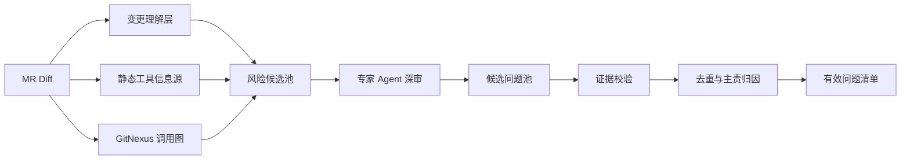
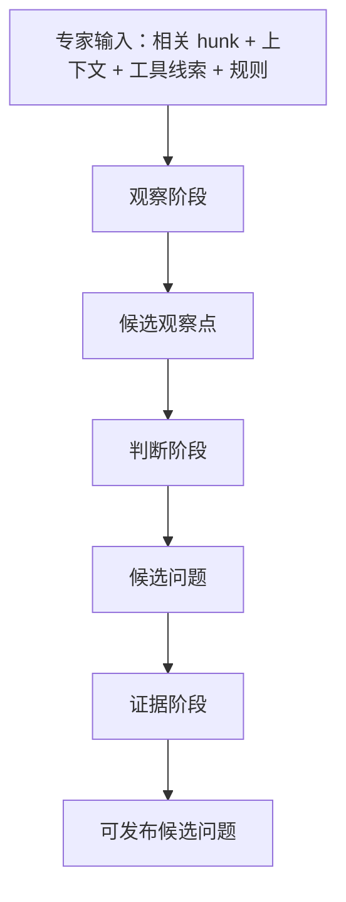

# 多专家 Agent 检视质量提升方案

## 1. 背景与目标

当前代码检视系统主要面向采用 DDD 方法论的 Spring Java Web 交易系统。此类系统的风险通常不只出现在单行代码上，而是分布在 Controller、Application Service、Domain、Repository、MQ、Redis、数据库事务和测试保护链路中。

单纯依赖大模型直接阅读 MR diff，容易出现以下问题：

- 关键专家未被选中，导致安全、业务、数据库、性能等风险漏检。
- 大 diff 下模型注意力分散，问题摘要、描述和代码片段对不上。
- 多个专家重复提出同一类问题，最终有效问题清单噪音较多。
- 裁决 Agent 复核后改写问题详情，反而造成展示质量下降。
- 对 DDD、Spring 事务、调用链、路径级规范等工程上下文理解不足。

本方案的目标是将系统从“让模型直接看 MR”升级为：

**系统负责多路召回和证据治理，专家 Agent 负责领域判断，最终只发布证据充分、归因清晰、研发能直接处理的问题。**

## 2. 核心原则

1. **问题必须由专家 Agent 提出**
   静态分析工具、GitNexus、规则文档和变更理解层都只提供信息，不直接生成有效问题。

2. **提高检出率优先**
   先不把 token 消耗作为核心约束，优先保证高价值风险能被召回、被专家看到、被正确判断。

3. **静态工具只作为信息源**
   工具输出统一进入 `tool_observations`，作为专家判断的辅助证据，不直接进入有效问题清单。

4. **专家职责边界清晰**
   同一个问题类别只能有一个主责专家，其他专家可以提供补充视角，但不能重复主提。

5. **证据门禁决定是否发布**
   任何候选问题进入有效问题清单前，必须通过文件、行号、代码锚点、描述、依据、建议的一致性校验。

6. **裁决 Agent 降权**
   裁决 Agent 只负责 `accept / reject / downgrade / needs_human`，不重写问题详情。

## 3. 总体架构



整体流程分为 8 个环节：

| 环节 | 作用 | 是否调用大模型 |
|---|---|---|
| 变更理解层 | 解析 diff，识别文件角色、方法、注解、风险域 | 否，优先规则实现 |
| 静态工具信息源 | 提供安全、架构、Java 缺陷、测试覆盖等线索 | 否 |
| GitNexus 调用图 | 提供调用链、上下游影响、影响范围 | 否 |
| 风险候选池 | 汇总所有线索，形成待专家判断的风险候选 | 否 |
| 专家 Agent 深审 | 由各领域专家判断是否构成真实问题 | 是 |
| 候选问题池 | 保存专家提出的候选问题 | 否 |
| 证据校验 | 校验问题与代码证据是否一致 | 优先规则，必要时 LLM 复核 |
| 去重与主责归因 | 合并重复问题，确定唯一主责专家 | 否 |

## 4. 变更理解层

变更理解层是整个质量提升的基础。它不直接提出问题，而是把 MR diff 转成结构化事实，供专家路由和上下文切片使用。

### 4.1 结构化输出

建议输出如下字段：

```json
{
  "files": [
    {
      "path": "src/main/java/com/example/order/application/OrderApplicationService.java",
      "language": "java",
      "file_role": "application_service",
      "changed_methods": ["submitOrder"],
      "annotations": ["Transactional"],
      "risk_domains": ["business", "transaction", "database", "mq"],
      "risk_signals": ["transactional_side_effect", "domain_event_publish", "repository_write"]
    }
  ],
  "changed_symbols": ["orderId", "userId", "amount", "status"],
  "business_terms": ["order", "payment", "inventory"],
  "risk_domains": ["business", "transaction", "database"],
  "expert_hints": ["correctness_business", "ddd_architecture", "database_analysis"]
}
```

### 4.2 识别内容

| 识别项 | 示例 | 用途 |
|---|---|---|
| 文件角色 | Controller、ApplicationService、Domain、Repository、Mapper、Consumer | 专家路由 |
| 方法变化 | 新增、删除、替换、调用顺序变化 | 证据锚点 |
| Spring 注解 | `@Transactional`、`@RequestMapping`、`@Async`、`@Scheduled` | 事务、安全、性能风险召回 |
| DDD 结构 | Aggregate、DomainService、Repository、Factory、DomainEvent | DDD 专家召回 |
| 数据访问 | Repository、Mapper、SQL、Criteria、JPA | 数据库专家召回 |
| 中间件 | MQ、Redis、Cache、Lock | 专项专家召回 |
| 测试变化 | 是否有测试文件同步变更 | 测试专家召回 |

## 5. 风险候选池

风险候选池用于承接所有召回线索。它不是问题清单，而是专家 Agent 的输入素材。

### 5.1 风险候选来源

| 来源 | 提供什么 |
|---|---|
| Diff 语义信号 | 新增/删除/替换的代码事实 |
| Java/Spring 结构规则 | 文件角色、注解、调用模式 |
| DDD 结构规则 | 分层、聚合、领域事件、仓储边界 |
| 静态分析工具 | 安全、Java 缺陷、架构约束、测试覆盖线索 |
| GitNexus | 调用链、影响范围、上下游入口 |
| 项目规范文档 | 项目级规则、路径级规则、专家绑定规范 |
| 历史人工反馈 | 已确认误报、漏报、有效问题模式 |

### 5.2 风险候选格式

```json
{
  "candidate_id": "risk_001",
  "source": "semgrep",
  "risk_domain": "security",
  "suggested_expert_id": "security_compliance",
  "file_path": "src/main/java/com/example/order/OrderController.java",
  "line_start": 42,
  "method_name": "queryOrders",
  "code_anchor": "jdbcTemplate.query(sql + userId)",
  "tool_observation": {
    "tool": "semgrep",
    "rule_id": "java.spring.sql-injection",
    "message": "SQL query is built from request input."
  }
}
```

## 6. 静态工具接入方案

静态工具的定位是提供信息，而不是替代专家判断。

### 6.1 第一批工具

| 优先级 | 工具 | 提供的线索 | 绑定专家 |
|---|---|---|---|
| P0 | Semgrep | SQL 注入、越权、敏感信息、Spring 安全误用、自定义 DDD/Spring 规则 | 安全专家、正确性专家、DDD 架构专家 |
| P0 | ArchUnit | 分层依赖、包依赖方向、DDD 边界、跨层调用 | DDD 架构专家 |
| P0 | SpotBugs | 空指针、资源泄漏、并发风险、危险 API、性能和安全 bug pattern | 通用编码专家、正确性专家、性能专家 |
| P1 | PMD | 空 catch、复杂度、重复代码、低效循环、坏味道 | 通用编码专家、可维护性专家、性能专家 |
| P1 | JaCoCo | 改动代码测试覆盖情况 | 测试验证专家 |

### 6.2 后续工具

| 工具 | 作用 | 绑定专家 |
|---|---|---|
| Checkstyle | Java 编码规范、命名、导入、格式 | 通用编码规范专家 |
| Error Prone | Java 编译期 bug pattern、集合/API/异常误用 | 通用编码专家、正确性专家 |
| OWASP Dependency-Check | Maven/Gradle 依赖漏洞、CVE | 安全合规专家 |
| OSV-Scanner | 开源依赖漏洞 | 安全合规专家 |
| PIT | 变异测试，识别弱断言测试 | 测试验证专家 |
| SQL Parser / SQLFluff | SQL 结构、危险查询、分页缺失 | 数据库专家 |

### 6.3 工具输出约束

工具输出统一称为：

- `tool_observations`
- `analysis_signals`
- `risk_hints`

禁止直接称为：

- `issues`
- `findings`
- `defects`

最终页面可以展示“辅助证据来源”，但问题归属必须是专家 Agent。

## 7. 专家 Agent 与技术域绑定

| 技术域 | 主责专家 | 协同专家 | 主要检视内容 |
|---|---|---|---|
| Java 通用规范 | 通用编码规范专家 | 可维护性专家 | 命名、异常、日志、空值、集合、魔法值、阿里 Java 规范 |
| DDD 架构 | DDD 架构专家 | 正确性专家 | 聚合边界、领域职责、应用服务职责、依赖方向、领域事件边界 |
| 业务正确性 | 正确性与业务专家 | DDD 架构专家 | 状态流转、金额/库存/订单规则、边界条件、返回值与副作用 |
| Spring 事务 | 正确性专家 | 数据库专家、性能专家 | `@Transactional`、提交顺序、异常回滚、事务内外部调用 |
| 数据库 | 数据库分析专家 | 性能专家 | SQL 语义、分页、索引、锁、事务隔离、批量读写 |
| 安全 | 安全合规专家 | 正确性专家 | 鉴权、越权、SQL 注入、敏感数据、租户隔离、输入校验 |
| 性能可靠性 | 性能与可靠性专家 | 数据库专家 | 循环内 DB/RPC、批量无边界、锁竞争、超时重试、资源释放 |
| MQ / 事件 | MQ 分析专家 | 正确性专家 | 消息顺序、幂等、ack、重试、死信、事件发布顺序 |
| Redis | Redis 分析专家 | 性能专家 | 缓存一致性、TTL、热点 key、分布式锁、Lua 原子性 |
| 测试验证 | 测试与验证专家 | 正确性专家 | 高风险变更的单测、集成测试、回归测试、并发测试 |

## 8. 专家三段式深审

为适配 minimax2.7，专家检视不应一次性生成最终问题，而应拆成三段：



| 阶段 | 目标 | 输出 |
|---|---|---|
| 观察阶段 | 找出该专家应该重点看的代码点 | `observations` |
| 判断阶段 | 判断观察点是否真的构成问题 | `candidate_findings` |
| 证据阶段 | 补齐代码锚点、影响说明、修复方向 | `evidence_enriched_findings` |

专家输出必须包含：

```json
{
  "expert_id": "security_compliance",
  "risk_domain": "security",
  "file_path": "OrderController.java",
  "method_name": "queryOrders",
  "line_start": 42,
  "code_anchor": "jdbcTemplate.query(sql + userId)",
  "claim": "订单查询接口把请求参数直接拼进 SQL，存在 SQL 注入风险。",
  "evidence": [
    "参数来自 Controller 请求入口",
    "当前代码使用字符串拼接构造 SQL",
    "未看到参数绑定或白名单校验"
  ],
  "impact": "攻击者可构造参数改变查询条件，读取或篡改非授权数据。",
  "fix_strategy": "改为参数绑定或 Criteria 查询，并补充恶意输入回归测试。",
  "confidence": 0.91,
  "adopted_tool_observations": ["semgrep:java.spring.sql-injection"]
}
```

## 9. 专家路由策略

### 9.1 质量优先路由

质量优先时，风险域命中后应强制激活对应专家，不能完全交给主 Agent 自由判断。

| 风险域信号 | 必须参与的专家 |
|---|---|
| Controller、用户输入、权限字段、租户字段 | 安全专家、正确性专家 |
| ApplicationService、状态流转、业务返回值变化 | 正确性专家、DDD 架构专家 |
| `@Transactional`、Repository 写入、事件发布 | 正确性专家、数据库专家、性能专家、MQ 专家 |
| Repository、Mapper、SQL、JPA、Criteria | 数据库专家、性能专家 |
| Redis、Cache、分布式锁、TTL | Redis 专家、性能专家 |
| Producer、Consumer、EventListener、ack、retry | MQ 专家、正确性专家 |
| 循环、批处理、定时任务、大数据量 | 性能专家、数据库专家、测试专家 |
| Aggregate、DomainService、Factory、DomainEvent | DDD 架构专家、正确性专家 |
| 高风险生产代码但无测试变更 | 测试验证专家 |

### 9.2 关联影响分析专家

关联影响分析专家默认参与每次 MR，但它只输出关联影响报告，不参与问题检视，不生成有效问题。

## 10. 证据门禁

候选问题进入有效问题清单前必须通过以下门禁：

| 门禁 | 要求 |
|---|---|
| 文件门禁 | `file_path` 必须属于当前 MR 或已验证的影响文件 |
| 行号门禁 | `line_start` 必须指向当前有效代码或明确的影响代码 |
| 删除代码门禁 | 只命中删除代码的问题不能发布 |
| 代码锚点门禁 | `code_anchor` 必须能在当前代码片段中找到 |
| 描述一致门禁 | 标题、摘要、问题说明、规范依据、修改思路必须讲同一个问题 |
| 工具证据门禁 | 若引用工具线索，必须说明专家是否采纳以及采纳原因 |
| 建议代码门禁 | 建议代码必须使用当前文件真实类名、方法名、变量名 |
| 条件化门禁 | 仍依赖“如果存在某条件”的猜测型问题不能进入有效问题 |

## 11. 去重与主责归因

重复问题的合并不能只看标题或行号，而应使用更稳定的指纹：

```text
fingerprint = risk_domain + primary_expert_id + file_path + method_name + root_cause + code_anchor
```

去重规则：

1. 同一文件、同一方法、同一根因的问题合并。
2. 不同专家发现同一问题时，只保留主责专家。
3. 其他专家观点进入 `participant_expert_ids` 或 `expert_views`。
4. 命名、日志、魔法值等通用规范问题按代表性问题合并，不刷屏。
5. 不同文件但同一调用链根因的问题，可以合并成“链路级问题”。

## 12. 裁决 Agent 职责调整

裁决 Agent 不再负责重写问题详情。

新的输出契约：

```json
{
  "verdict": "accept",
  "reason": "代码锚点、问题描述和修复方向一致，证据充分。",
  "evidence_score": 0.88,
  "suggested_action": "publish"
}
```

允许的 verdict：

| verdict | 含义 |
|---|---|
| `accept` | 证据充分，可发布 |
| `downgrade` | 问题存在但风险较低，降级展示 |
| `needs_human` | 需要人工确认 |
| `reject` | 证据不足或代码不匹配，不发布 |

## 13. Minimax2.7 适配策略

| Minimax 常见问题 | 方案 |
|---|---|
| 大 diff 下注意力分散 | 按专家、文件角色、风险域切片 |
| 安全/业务问题漏检 | 风险域召回后强制激活专家 |
| 问题描述和代码片段对不上 | 候选问题必须绑定代码锚点，并通过证据门禁 |
| 多个问题标题重复 | 按风险域、根因、代码锚点、主责专家去重 |
| TODO/注释承诺虚报 | 必须同时证明“具体承诺”和“当前实现缺失” |
| 建议代码乱写 | 建议代码必须通过当前符号校验 |
| 裁决后内容变差 | 裁决只做发布状态判断，不改写详情 |

## 14. 评测闭环

质量提升必须配套评测，不能只靠人工感觉。

### 14.1 Benchmark 覆盖范围

面向 Java DDD Spring Web 交易系统，至少覆盖：

| 类别 | 典型问题 |
|---|---|
| 业务正确性 | 状态流转错误、金额/库存/订单规则破坏、返回值与副作用不一致 |
| DDD 架构 | 聚合边界绕过、领域逻辑泄漏、领域事件时序错误 |
| 事务一致性 | 事务边界错误、异常吞掉导致不回滚、外部调用放进事务 |
| 数据库 | 无分页大查询、N+1、锁范围错误、索引/约束风险、SQL 语义放宽 |
| 安全 | 越权、租户隔离缺失、SQL 注入、敏感字段泄露、输入校验缺失 |
| 性能可靠性 | 循环内 DB/RPC、批处理无边界、锁竞争、超时重试缺失 |
| MQ / 事件 | 重复消费不幂等、ack 时机错误、死信缺失、事件发布顺序错误 |
| Redis | 缓存与 DB 不一致、TTL 缺失、分布式锁误用、热点 key |
| 测试 | 高风险改动缺少单测、集成测试、并发测试、回归验证 |

### 14.2 质量指标

| 指标 | 目标 |
|---|---|
| P0/P1 召回率 | 90%+ |
| 有效问题误报率 | 20% 以下 |
| 证据一致率 | 95%+ |
| 重复率 | 接近 0 |
| 专家激活准确率 | 强相关风险域专家必须参与 |
| 展示可读性 | 标题、摘要、说明、依据、建议互相一致 |

## 15. 实施阶段

| 阶段 | 内容 | 主要产出 |
|---|---|---|
| 第 1 阶段 | 实现变更理解层和风险候选池 | `change_understanding`、`risk_candidates` |
| 第 2 阶段 | 改造专家路由，风险域强制绑定专家 | 更稳定的专家选择 |
| 第 3 阶段 | 接入 Semgrep、ArchUnit、SpotBugs | `tool_observations` |
| 第 4 阶段 | 重写专家 Prompt 为三段式深审 | 更稳定的专家输出 |
| 第 5 阶段 | 强化证据门禁、建议代码校验、跨专家去重 | 更可信的有效问题清单 |
| 第 6 阶段 | 建立 Java DDD Spring benchmark 和真实 MR 回归评测 | 可量化质量闭环 |

## 16. 预期效果

实施后，系统应具备以下能力：

1. 安全、业务、数据库、性能等关键专家不再因为主 Agent 判断不足而漏选。
2. 静态工具、GitNexus、规范文档和历史反馈能共同提升风险召回。
3. 专家 Agent 不再漫无目的看 diff，而是围绕风险候选和证据深审。
4. 有效问题清单中的问题描述、代码片段、规范依据和修改建议保持一致。
5. 重复问题显著减少，同一问题只保留一个主责专家。
6. 真实 Java DDD Spring MR 的高价值问题检出率提升，假阳率下降。

## 17. 一句话总结

**静态工具负责把灯照亮，GitNexus 负责补调用链，系统负责召回和证据治理，专家 Agent 负责判断并提出问题。**
