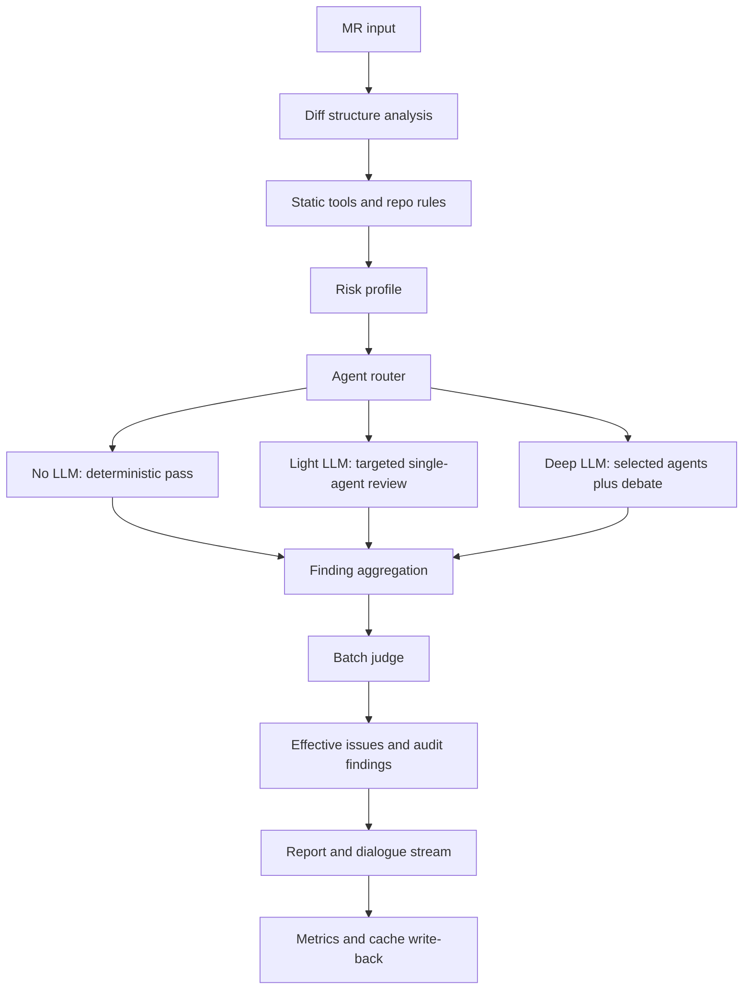

# LLM Call Reduction Review Speed Design Implementation Plan

> **For Claude:** REQUIRED SUB-SKILL: Use superpowers:executing-plans to implement this plan task-by-task.

**Goal:** Reduce overall code review latency and LLM call volume without lowering final issue quality.

**Architecture:** Use a layered review pipeline: deterministic diff analysis and static tools first, risk-based agent routing second, targeted LLM review third, batch judge and conflict-only debate last. Static tool output remains candidate evidence and must not be directly promoted to final issues.

**Tech Stack:** FastAPI backend, SQLite/PostgreSQL repositories, React/Vite frontend, PMD/Semgrep/ESLint/static-tool observations, existing multi-agent review runner, existing review dialogue stream.

---

## Industry References

This design follows the common direction used by modern AI code review and SAST platforms:

- GitHub Copilot Code Review combines AI review with tool support; GitHub documentation notes CodeQL is enabled by default for new tool-enabled Copilot review flows, while tools such as ESLint and PMD are configurable.
  - Reference: https://docs.github.com/copilot/concepts/code-review
- GitHub CodeQL/code scanning runs semantic analysis and displays results in pull requests and security views.
  - Reference: https://github.com/github/codeql-action
- Semgrep Assistant / Multimodal first produces findings, then uses AI for triage, remediation guidance, and suggested fixes.
  - Reference: https://semgrep.dev/docs/semgrep-code/findings
  - Reference: https://semgrep.dev/docs/semgrep-assistant/analyze
- SonarQube pull request analysis focuses on new code and quality gates rather than re-reviewing the whole repository each time.
  - Reference: https://docs.sonarsource.com/sonarqube/8.9/analysis/pull-request/
  - Reference: https://docs.sonarsource.com/sonarqube/latest/user-guide/quality-gates

The key lesson is: static analysis and deterministic rules should find and structure candidate evidence; LLMs should focus on semantic validation, impact reasoning, and actionable remediation.

## Current Problem

The current review pipeline can be slow because it tends to spend LLM calls broadly:

- Small MRs may still route to too many agents.
- Agents receive overlapping context.
- Static-tool hits are not always used as a first-class prefilter.
- Debate can run for findings that do not truly need conflict resolution.
- Judge may process findings too granularly.
- Repeat reviews and reruns do not reuse enough stable analysis.

The optimization must avoid these anti-patterns:

- Do not skip high-risk domains to save time.
- Do not promote static tool hits directly to effective issues.
- Do not hide why an agent was skipped.
- Do not let history/list performance optimizations change final issue counts.
- Do not make the user believe LLM quality was reduced when the pipeline only avoided low-value calls.

## Target Review Pipeline



## Design Principles

- **Static tools first:** PMD, Semgrep, ESLint, TypeScript checks, CodeQL-like outputs, and custom rules create structured observations before LLM review.
- **Risk-based routing:** Select agents by changed files, diff signals, static-tool findings, and repository rules.
- **Targeted context:** Each agent receives only relevant file hunks, tool observations, and matched knowledge rules.
- **Batch decisions:** Judge grouped findings in batches instead of one LLM call per finding.
- **Conflict-only debate:** Debate is reserved for high-risk, ambiguous, or conflicting findings.
- **Transparent speed:** The dialogue stream must show skipped agents, selected agents, static-tool results, and why LLM calls were avoided.
- **Quality lock:** Effective issue promotion is still controlled by confidence, severity, evidence, and current diff relevance.

## Data Contracts

### Diff Profile

Create or normalize a `diff_profile` object during intake:

```json
{
  "changed_file_count": 6,
  "changed_line_count": 120,
  "languages": ["java", "typescript"],
  "layers": ["controller", "service", "repository"],
  "risk_signals": [
    "query_boundary_changed",
    "exception_handler_changed",
    "auth_related_path"
  ],
  "size_bucket": "small",
  "requires_deep_review": true
}
```

### Tool Observation

Static tools should emit observations, not final issues:

```json
{
  "tool": "semgrep",
  "rule_id": "java.sql-injection",
  "file_path": "src/main/java/demo/UserDao.java",
  "line_start": 42,
  "severity": "high",
  "confidence": 0.86,
  "message": "User input flows into SQL string concatenation",
  "diff_related": true,
  "observation_id": "sast:semgrep:java.sql-injection:src/main/java/demo/UserDao.java:42"
}
```

### Risk Profile

```json
{
  "risk_level": "medium",
  "risk_domains": ["database", "security"],
  "must_review_agents": ["database_analysis", "security_compliance"],
  "optional_agents": ["correctness_business"],
  "skip_agents": ["frontend_ui", "architecture_design"],
  "llm_strategy": "targeted_review",
  "debate_required": false,
  "reason": "SQL query boundary and security tool observations were detected; no UI or architecture contract changes were found."
}
```

## Execution Strategies

### no_llm

Use when the MR only changes documentation, comments, formatting, or files that deterministic rules classify as non-executable.

Expected behavior:

- Do not call review agents.
- Record the reason in the dialogue stream.
- Return a completed review with no effective issues unless static tools found a high-risk candidate.

### light_review

Use for small MRs with no high-risk tool hits.

Expected behavior:

- Select at most 1-2 agents.
- Skip debate.
- Use a small batch judge or deterministic promotion rules for clearly validated findings.

### targeted_review

Use for medium-risk MRs with specific risk domains.

Expected behavior:

- Select 1-3 agents based on risk domains.
- Send each agent only relevant hunks and tool observations.
- Run batch judge after findings are collected.
- Run debate only for conflicts or high-risk ambiguity.

### deep_review

Use for high-risk MRs, thorough review mode, security/auth/data consistency/concurrency changes, or large cross-file changes.

Expected behavior:

- Select all required agents, not all available agents.
- Include impact analysis and cross-file context.
- Debate high-risk or conflicting findings.
- Keep static-tool observations visible in the dialogue and final report.

## Agent Routing Rules

| Signal | Must-review agents | Optional agents | Agents to skip by default |
| --- | --- | --- | --- |
| SQL, Repository, pagination, query limit | `database_analysis` | `correctness_business` | `frontend_ui` |
| Auth, token, permission, sensitive data | `security_compliance` | `architecture_design` | `frontend_ui` |
| Exception handling, return semantics | `correctness_business` | `architecture_design` | `frontend_ui` |
| React component, UI behavior | `frontend_ui` | `correctness_business` | `database_analysis` |
| Config, dependency, CI, deployment | `architecture_design` | `security_compliance` | `frontend_ui` |
| Documentation, comments only | none | none | all LLM agents |

The router must emit a dialogue event like:

```text
Agent routing completed: selected database_analysis and correctness_business because the MR changes Repository query boundaries and exception handling. Skipped frontend_ui because no UI files changed.
```

## Static Tool Integration

Static tools should be integrated as a pre-scan stage:

1. Run only tools relevant to changed languages and paths.
2. Normalize raw outputs into `tool_observations`.
3. Match observations to diff hunks.
4. Add observations to agent-specific context.
5. Preserve adopted observations on findings and issues through `tool_observations`, `sast_prescan_matches`, `tool_verified`, and `sast_cross_validated`.
6. Show scanner start/completion and adoption counts in the dialogue stream.

Static tool observations are allowed to:

- Increase priority for agent selection.
- Provide evidence to an agent.
- Trigger deep review for critical risk.
- Explain why a finding was reviewed.

Static tool observations are not allowed to:

- Directly create an effective issue.
- Override issue confidence thresholds.
- Hide unpromoted reasons.

## Context Reduction

Use three context layers:

### Global Context

Built once per review:

- MR metadata
- changed files
- risk profile
- static-tool summary
- matched repo policy
- concise diff summary

### Agent Context

Built per selected agent:

- relevant files only
- relevant diff hunks only
- relevant static-tool observations
- relevant knowledge rules
- compact cross-file context

### Finding Context

Built per finding or finding batch:

- file path
- line range
- current code snippet
- diff hunk
- tool observation IDs
- matched rule IDs
- remediation constraints

## Batch Judge

Group findings by:

```text
file_path + normalized_issue_type + risk_domain
```

Recommended batch sizes:

- High risk: 5 findings per call.
- Normal risk: 8 findings per call.
- Low risk: 12 findings per call.

Judge output:

```json
{
  "decisions": [
    {
      "finding_id": "fdg_001",
      "decision": "promote_to_issue",
      "confidence": 0.88,
      "reason": "The current diff removes a pagination boundary and can trigger a full repository scan.",
      "merge_with": ""
    },
    {
      "finding_id": "fdg_002",
      "decision": "keep_as_finding",
      "reason": "The evidence points to unchanged code and does not affect the current diff."
    }
  ]
}
```

Requirements:

- Every unpromoted finding must have a user-visible reason.
- Effective issue count must match the issue detail page.
- Judge must not invent file paths or line numbers.
- Judge must preserve original code anchor fidelity.

## Debate Rules

Enter debate only when:

- selected agents disagree on the same root cause
- severity is high/critical but evidence is incomplete
- static-tool high-risk observation was rejected by an agent
- the issue involves auth, security, payment, data consistency, concurrency, or production config
- remediation may change business behavior

Skip debate when:

- a single agent has high-confidence evidence and static-tool support
- the issue is low severity and low confidence
- the finding is clearly outside the current diff
- the finding was already filtered by policy or confidence threshold

## Caching

Cache these stable artifacts:

- `diff_profile`
- `tool_observations`
- `risk_profile`
- `agent_routing_result`
- `file_summary`
- `rule_match_result`
- `finding_judge_decision`
- `impact_context`

Cache key:

```text
repo_id + source_ref + target_ref + diff_hash + runtime_settings_hash + tool_config_hash + expert_profile_hash
```

Invalidate when:

- diff changes
- static-tool config changes
- expert prompt/profile changes
- issue threshold config changes
- knowledge base or repository policy changes

## Dialogue Stream Requirements

The dialogue stream must include:

- diff analysis result
- static-tool scan start and completion
- tool observation counts by tool and severity
- selected agents and skipped agents
- LLM strategy: `no_llm`, `light_review`, `targeted_review`, or `deep_review`
- estimated and actual LLM call count
- finding promotion summary
- unpromoted finding reasons
- debate trigger reasons
- cache hit/miss summary

Example:

```text
Review strategy: targeted_review. Selected database_analysis and correctness_business. Skipped frontend_ui because no UI files changed. Static tools produced 3 observations; 1 was promoted to an effective issue after judge validation, 2 remained audit findings with reasons.
```

## Runtime Settings

Add a review performance strategy group:

```json
{
  "review_execution_strategy": "auto",
  "small_mr_changed_lines": 80,
  "medium_mr_changed_lines": 400,
  "max_agents_for_small_mr": 2,
  "max_agents_for_medium_mr": 3,
  "enable_static_tool_prefilter": true,
  "enable_agent_routing": true,
  "enable_judge_batching": true,
  "enable_debate_only_on_conflict": true,
  "enable_review_cache": true,
  "force_deep_review_for_security": true,
  "force_deep_review_for_auth": true,
  "force_deep_review_for_data_consistency": true
}
```

Mode mapping:

- Standard mode: `auto` routing plus targeted review.
- Thorough review: more context and more required agents, but still route by risk.
- Fast review: no-LLM and light review preferred, with high-risk overrides.

## Metrics

Track performance:

- total review duration
- LLM call count
- LLM calls by agent
- prompt tokens and completion tokens
- static-tool duration
- routing duration
- judge duration
- debate duration
- cache hit rate

Track quality:

- finding count
- effective issue count
- static-tool observation count
- static-tool adoption rate
- human rejection rate
- human confirmation rate
- unpromoted reason distribution
- rerun issue stability
- benchmark score before/after optimization

Target improvements:

```text
Small MR LLM calls: reduce by 50%-80%
Medium MR LLM calls: reduce by 30%-60%
Average review duration: reduce by 40%-60%
Human rejection rate: must not increase materially
High-risk recall: must not regress in benchmark cases
```

## Implementation Tasks

### Task 1: Add diff profile generation

**Files:**

- Modify: `backend/app/services/review_service.py`
- Modify: `backend/app/services/review_runner.py`
- Test: `backend/tests/services/test_review_execution_strategy.py`

**Steps:**

1. Add a helper that computes changed file count, changed line count, language list, layer list, and risk signals.
2. Store `diff_profile` under review subject metadata.
3. Add tests for docs-only, frontend-only, SQL/repository, auth/security, and exception-handling MRs.

### Task 2: Add risk-based agent router

**Files:**

- Modify: `backend/app/services/review_runner.py`
- Modify: `backend/app/services/review_queue_support.py`
- Test: `backend/tests/services/test_agent_routing_strategy.py`

**Steps:**

1. Convert `diff_profile` and `tool_observations` into `risk_profile`.
2. Select must-review agents, optional agents, and skipped agents.
3. Add dialogue events explaining agent selection and skip reasons.
4. Ensure thorough review can still force additional high-risk agents.

### Task 3: Make static-tool observations first-class routing evidence

**Files:**

- Modify: `backend/app/services/review_runner.py`
- Modify: `backend/app/services/review_service_report.py`
- Modify: `frontend/src/components/review/ReviewDialogueStream.tsx`
- Test: `backend/tests/services/test_sast_tool_observation_routing.py`

**Steps:**

1. Normalize tool output into `tool_observations`.
2. Match observations to diff hunks.
3. Use observations for routing but not direct issue promotion.
4. Project observation adoption into report and dialogue stream.

### Task 4: Add LLM execution strategy

**Files:**

- Modify: `backend/app/domain/models/runtime_settings.py`
- Modify: `backend/app/api/routes/settings.py`
- Modify: `frontend/src/pages/Settings/index.tsx`
- Test: `backend/tests/services/test_review_execution_strategy.py`

**Steps:**

1. Add runtime settings for execution strategy and thresholds.
2. Map strategy to `no_llm`, `light_review`, `targeted_review`, or `deep_review`.
3. Ensure high-risk domains override fast mode.
4. Show selected strategy in the dialogue stream.

### Task 5: Add batch judge

**Files:**

- Modify: `backend/app/services/review_runner.py`
- Modify: `backend/app/services/review_runner_issue_validation.py`
- Test: `backend/tests/services/test_batch_judge.py`

**Steps:**

1. Group findings by file, issue type, and risk domain.
2. Judge groups in batches.
3. Preserve unpromoted reasons.
4. Verify effective issue count matches detail page.

### Task 6: Restrict debate to conflicts and high-risk ambiguity

**Files:**

- Modify: `backend/app/services/orchestrator/nodes/detect_conflicts.py`
- Modify: `backend/app/services/orchestrator/nodes/judge_and_merge.py`
- Test: `backend/tests/services/test_conflict_only_debate.py`

**Steps:**

1. Add debate trigger rules.
2. Skip debate for high-confidence single-source findings with strong evidence.
3. Force debate for high-risk ambiguity.
4. Emit debate trigger or skip reason in dialogue events.

### Task 7: Add review cache

**Files:**

- Create: `backend/app/repositories/review_cache_repository.py`
- Modify: `backend/app/repositories/storage_factory.py`
- Modify: `backend/app/services/review_runner.py`
- Test: `backend/tests/services/test_review_cache.py`

**Steps:**

1. Add cache table or file-backed cache.
2. Compute cache keys from repo, refs, diff hash, runtime settings hash, tool config hash, and expert profile hash.
3. Cache diff profile, tool observations, routing result, and file summaries.
4. Emit cache hit/miss events.

### Task 8: Add metrics and dashboard fields

**Files:**

- Modify: `backend/app/services/review_service_projection.py`
- Modify: `frontend/src/pages/Governance/index.tsx`
- Test: `backend/tests/services/test_review_performance_metrics.py`

**Steps:**

1. Persist LLM call count by review and agent.
2. Aggregate static-tool adoption rate.
3. Add cache hit rate and strategy distribution.
4. Show before/after metrics in governance center.

## Verification Plan

Run focused backend tests:

```bash
.venv/bin/python -m pytest \
  backend/tests/services/test_agent_routing_strategy.py \
  backend/tests/services/test_sast_tool_observation_routing.py \
  backend/tests/services/test_batch_judge.py \
  backend/tests/services/test_conflict_only_debate.py \
  backend/tests/services/test_review_cache.py \
  -q
```

Run existing quality regression tests:

```bash
.venv/bin/python -m pytest \
  backend/tests/services/test_review_service_projection.py \
  backend/tests/services/test_review_issues.py \
  backend/tests/services/test_main_agent_service.py \
  -q
```

Run frontend validation:

```bash
npm run typecheck
npm run build
```

Run benchmark comparison:

```bash
python3 scripts/bench_java_review_cases.py
python3 scripts/score_java_benchmark_review.py
```

Acceptance criteria:

- Small MR no longer selects all agents by default.
- Static-tool process and results appear in the dialogue stream.
- LLM call count is recorded per review.
- Batch judge preserves unpromoted reasons.
- Effective issue count remains consistent between history list and issue detail page.
- High-risk benchmark recall does not regress.
- Human rejection rate does not materially increase.

## Rollout Plan

1. Enable routing and dialogue transparency first.
2. Enable static-tool prefilter as candidate evidence only.
3. Enable batch judge behind a runtime setting.
4. Enable conflict-only debate behind a runtime setting.
5. Enable cache after quality metrics are stable.
6. Compare optimized vs baseline reviews on the Java benchmark suite.
7. Make `auto` execution strategy the default only after benchmark quality remains stable.

## Risks

- Over-aggressive routing may skip a needed agent.
- Static-tool observations may bias LLM validation if prompts treat them as verdicts.
- Batch judge may merge unrelated findings if grouping keys are too broad.
- Cache may reuse stale analysis if settings hash is incomplete.
- Dialogue stream may become noisy if every internal rule is emitted.

## Risk Controls

- High-risk domains always override fast mode.
- Static-tool observations must be described as candidate evidence.
- Batch judge grouping must include file path and normalized issue type.
- Cache key must include config and expert profile hashes.
- Dialogue stream should summarize decisions and expose details on expansion.

